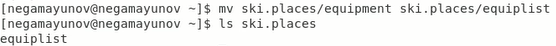
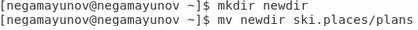
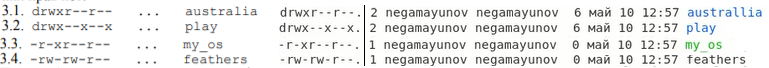
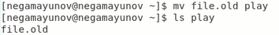
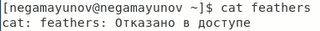

<!-- _class: titleslide -->
# Лабораторная работа №5
### Выполнил Гамаюнов Никита, 1032201719, НПМбд-01-20

---
# Прагматика выполнения работы
**Цель:** Ознакомление с файловой системой Linux, её структурой, именами и содержанием каталогов. Приобретение практических навыков по применению команд для работы с файлами и каталогами, по управлению процессами (и работами), по проверке использования диска и обслуживанию файловой системы.
**Задача:**  Ознакомиться с файловой системой Linux, приобрести практические навыки по применению команд копирования, перемещения и управления правами для работы с ней.

---

# Процесс выполнения работы
1. Повторил все примеры из методического введения к лабораторной работе
   

---

1.  Выполнил задания, связанные с командами копирования и перемещения
   

---

1. Определил опции команды chmod, которые задают нужным файлам необходимые по условию права для пользователей

---

4. Проделал ещё ряд упражнений, связанных с взаимодействием с системы через терминал

    

    

    

    

---

<!-- _class: titleslide -->
# Выводы
Я ознакомился с файловой системой Linux, её структурой, именами и содержанием каталогов. Приобрёл практические навыки по применению команд для работы с файлами и каталогами, по управлению процессами (и работами), по проверке использования диска и обслуживанию файловой системы.