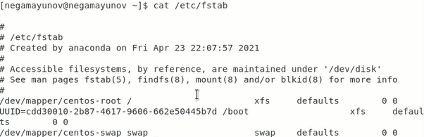

# Лабораторная работа №6
## По дисциплине Операционнные системы
### Выполнил Гамаюнов Н.Е., студент ФФМиЕН РУДН, НПМбд-01-20, 1032201717
### Преподаватель Кулябов Дмитрий Сергеевич
### Москва, 2021 г.

# Цель работы
Ознакомление с файловой системой Linux, её структурой, именами и содержанием каталогов. Приобретение практических навыков по применению команд для работы с файлами и каталогами, по управлению процессами (и работами), по проверке использования диска и обслуживанию файловой системы.

# Задания
Ознакомиться с файловой системой Linux, приобрести практические навыки по применению применению команд копирования, перемещения и управления правами для работы с ней.

# Выполнение лабораторной работы
**1. Повторил все примеры из методического введения к лабораторной работе:**
1. Скопировал файл ~/abc1 в файл april и в файл may *(рисунок 1)*:
   
    

     Рисунок 1

2. Скопировал  файлы april и may в каталог monthly *(рисунок 2)*:

    

      Рисунок 2

3. Скопировал файл monthly/may в файл с именем june *(рисунок 3)*:
   
      

      Рисунок 3

4. Скопировал каталог monthly в каталог monthly.00 *(рисунок 4)*:
   
    

    Рисунок 4

 5. Скопировал каталог monthly.00 в каталог /tmp *(рисунок 5)*:

      

      Рисунок 5
    
6. Изменил название файла april на july в домашнем каталоге *(рисунок 6)*:
   
     

     Рисунок 6

 7. Переместил файл july в каталог monthly.00 *(рисунки 7 и 8)*:
   
     

     Рисунок 7

    

     Рисунок 8

8. Переименовал каталог monthly.00 в monthly.01 *(рисунок 9)*:
   
      

      Рисунок 9

9. Переместил каталог monthly.01 в каталог reports *(рисунок 10)*:

     

     Рисунок 10

10.  Переименовал каталог reports/monthly.01 в reports/monthly *(рисунок 11)*:

     

     Рисунок 11

11.  Создал файл ~/may с правом выполнения для владельца *(рисунок 12)*:

     

     Рисунок 12

12.  Лишил владельца файла ~/may права на выполнение *(рисунок 13)*:

     

      Рисунок 13

13.  Запретил чтение каталога monthly для членов группы и всех остальных пользователей *(рисунок 14)*:

        

     Рисунок 14

14.  Разрешил членам группы запись в файл ~/abc1 для членов группы *(рисунок 15)*:

        

     Рисунок 15

15.  Для просмотра используемых в операционной системе файловых систем воспользовался командой mount *(рисунок 16)*:

        

        Рисунок 16
16.  Воспользовался другим способом просмотра смонтированных файловый систем - просмотрел файл /etc/fstab *(рисунок 17)*:

        

        Рисунок 17

17.  Воспользоваться командой df, которая вывела на экран список всех файловых систем в соответствии с именами устройств, с указанием размера и точки монтирования *(рисунок 18)*:
  
        

        Рисунок 18

18.   С помощью команды fsck проверил целостность файловой системы *(рисунок 19)*: 
  
        

        Рисунок 19

**2.  Выполнил задания, связанные с командами копирования и перемещения (переименования):**

1. Скопировал файл /usr/include/sys/io.h в домашний каталог и назвал его equipment *(рисунок 20)*:

      

    Рисунок 20

2. В домашней директории создал каталог ski.places *(рисунок 21)*:

      

    Рисунок 21

3. Переместил файл equipment в каталог ~/ski.plases *(рисунок 22)*:

      

    Рисунок 22

4. Переименовал файл ~/ski.plases/equipment в ~/ski.plases/equiplist *(рисунок 23)*:

      

    Рисунок 23

5. Создал в домашнем каталоге файл abc1 и скопировал его в каталог ~/ski.plases, назвав equiplist2 *(рисунок 24)*:

      

    Рисунок 24

6. Создал каталог с именем equipment в каталоге ~/ski.plases *(рисунок 25)*:

      

    Рисунок 25

7. Переместил файлы ~/ski.plases/equiplist и equiplist2 в каталог ~/ski.plases/equipment.

      

    Рисунок 26

8. Создал и переместил каталог ~/newdir в каталог ~/ski.plases и назвал его plans.

      

    Рисунок 27

**3. Определил опции команды chmod, которые задают нужным по условию файлам необходимые по условию права для пользователей** ***(рисунки 28 и 29):***

Рисунок 28

Рисунок 29. Слева - условие, справа - результат, просмотренный с использованием команды ls и ключем -l.

    Права, которых пользователи лишаются, отсутствуют у них по условию и их можно было не отнимать у юзеров, но здесь я просто захотел попроактиковаться "по полной".

**4. Проделал ещё ряд упражнений, связанных с взаимодействием с системы через терминал:**
1. Первым заданием было просмотреть содержимое файла /etc/password. Я столкнулся с проблемой: файла /etc/password не существовало *(рисуноу 30)*, зато существовал /etc/passwd. Его содержимое я и просмотрел с помощью команды cat *(рисунок 31)*:

    

    Рисунок 30. Можем заметить явное отсутствие файла password.

    

    Рисунок 31. Результат выполнения команды cat passwd из каталога /etc

2. Скопировал файл ~/feathers в файл ~/file.old. *(рисунок 32)*:

    

    Рисунок 32.

3. Переместил  файл ~/file.old в каталог ~/play *(рисунок 33)*:

    

    Рисунок 33.

4. Скопировал каталог ~/play в каталог ~/fun *(рисунок 34)*:

    

    Рисунок 34.

5. Переместил каталог ~/fun в каталог ~/play и назвал его games *(рисунок 35)*:

    

    Рисунок 35.

6. Лишил владельца файла ~/feathers права на чтение *(рисунок 36)*:

    

    Рисунок 36.

7. Теперь, если я попробую прочитать файл feathers командой cat, в доступе будет отказано *(рисунок 37)*:

    

    Рисунок 37.

8. Если попытаться скопировать файл feathers командой cp, получим идентичный отказ *(рисунок 38)*:

    

    Рисунок 38.

9. Дал владельцу файла ~/feathers право на чтение, проверил с помощью cat *(рисунок 39)*:

    

    Рисунок 39.

10. Лишил владельца каталога ~/play права на выполнение *(рисунок 40)*:

    

    Рисунок 40.

11. Попробовал перейти в каталог ~/play. В доступе было отказано *(рисунок 41)*:

    

    Рисунок 41.

12. Вернул владельцу ~/play права на выполнение. Теперь проблем с переходом в этот каталог не возникает *(рисунок 42)*:

    

    Рисунок 42.

13. Прочитал man по командам mount, fsck, mkfs, kill *(рисунок 43)*.

    

    Рисунок 43.

**Краткая характеристика программ:**

- *mount* позволяет смонтировать файловую систему. 
  
  Синтаксис: mount [опции] файл_устройства папка_назначения.

    **Пример:** mount /dev/sdb6 /mnt смонтирует раздел /dev/sdb6 в папку /mnt

- *fsck* позволяет проверить и в некоторых случаях восстановить целостность файловой системы

    Синтаксис: fsck [опции] имя_устройства

    **Пример:** fsck /dev/sda1 проверит целостность системы, смонтированной на устройстве /dev/sda1

- *mkfs* позволяет создать новую файловую систему.

    Синтаксис: mkfs -t [опции] тип устройство

    **Пример:** создадим файловую систему типа ext4 на устройстве /dev/sda6: mkfs -t ext4 /dev/sda6

    *(источник [losst.ru | Работа с файловой системой в Linux](https://losst.ru/rabota-s-fajlovoj-sistemoj-linux))*

- *kill* позволяет "убить" (прервать) процесс.
  
  Синтаксис: kill [опции] PID *(PID - идентификатор процесса)*

  **Пример:** чтобы "убить" процесс с PID 20446 деликатно, то есть, дать программе программа все дочерние процессы и освободить все ресурсы, воспользуемся опцией -TERM: kill -TERM 20466.

# Выводы
Я ознакомился с файловой системой Linux, её структурой, именами и содержанием каталогов. Приобрёл практические навыки по применению команд для работы с файлами и каталогами, по управлению процессами (и работами), по проверке использования диска и обслуживанию файловой системы.

# Ответы на контрольные вопросы
1. Для начала нужно посмотреть, какие файловые системы вообще смонтированы на моём пк, с помощью команды df с ключем -TH *(рисунок 44)*:

    

    Рисунок 44.
    
    - **tmpfs** позволяет размещать любые пользовательские файлы в оперативной памяти компьютера. 
    *(источник - [losst.ru](https://losst.ru/rabota-s-fajlovoj-sistemoj-linux))*
    - **XFS** - это высоко масштабируемая, высокопроизводительная файловая система, которая была изначально разработана в Silicon Graphics в 1993 году. Она была добавлена в основной состав ядра Linux в 2002 году. Сейчас она используется в качестве файловой системы по умолчанию в операционных системах семейства Red Hat. *(источник - [losst.ru](https://losst.ru/fajlovaya-sistema-xfs))*
    - **ISO 9660** - стандартная файловая система для чтения CD-ROM. Также широко используется для чтения DVD и может применяться для USB или жестких дисков. Бесплатно доступна под названием ECMA-119. *(источник [OSdev wiki](https://wiki.osdev.org/ISO_9660))*

2. На просторах Интернета легко найти схему файловой системы, воспользуемся одной из них *(рисунок 45)*

    

    Рисунок 45.

    - **/ - корень.** Корневой каталог содержит в себе остальные, и путь к любому файлу начинается именно с /. Только пользователь root может изменять файлы непосредственно в корневом каталоге.
    - **/bin (binaries) - бинарные файлы пользователя.** Каталог с исполняемыми файлами, содержит программы, которые можно использовать в однопользовательском режиме, то есть, ещё до подключения каталога /usr. Например, команды cat, cp, mv и т.д.
    - **/boot - файлы загрузчика.** Содержит все файлы, связанные с загрузчиком системы. Это ядро vmlinuz, образ initrd, а также файлы загрузчика, находящие в каталоге /boot/grub.
    - **/etc (etcetera) - конфигурационные файлы.** Здесь файловая система может быть довольно запустанной, но основная цель всего, что тут содержится - настройка и конфигурация системы.
    - **/dev (devices) - файлы устройств.** В Linux все подключенные флешки, клавиатуры, микрофоны, камеры - это просто файлы в каталоге /dev/. Этот каталог содержит не совсем обычную файловую систему. Структура файловой системы Linux и содержащиеся в папке /dev файлы инициализируются при загрузке системы, сервисом udev. Выполняется сканирование всех подключенных устройств и создание для них специальных файлов.
    - **/mnt (mount) - монтирование.** В этот каталог системные администраторы могут монтировать внешние или дополнительные файловые системы.
    - **/home - домашняя папка.** В этой папке хранятся домашние каталоги всех пользователей. В них они могут хранить свои личные файлы, настройки программ и т.д.
    - **/opt (optional applications) - дополнительные программы.** В эту папку устанавливаются проприетарные программы, игры или драйвера. Это программы созданные в виде отдельных исполняемых файлов самими производителями.
    - **/sbin (system binaries) - системные исполняетмые файлы.** Так же как и /bin, содержит двоичные исполняемые файлы, которые доступны на ранних этапах загрузки, когда не примонтирован каталог /usr. Но здесь находятся программы, которые можно выполнять только с правами суперпользователя. Это разные утилиты для обслуживания системы. Например, iptables, reboot, fdisk, ifconfig,swapon и т.д.
    - **/usr (user applications) - программы пользователя.** Это самый большой каталог с большим количеством функций. Тут наиболее большая структура каталогов Linux. Здесь находятся исполняемые файлы, исходники программ, различные ресурсы приложений, картинки, музыку и документацию.
    - **/tmp (temporary) - временные файлы.** В этом каталоге содержатся временные файлы, созданные системой, любыми программами или пользователями. Все пользователи имеют право записи в эту директорию. Файлы удаляются при каждой перезагрузке.
    - **/root - домашний каталог пользователя root.**
    - **/var (variable) - переменные файлы.** Этот каталог содержит файлы, которые часто изменяются, а значит, размер этих файлов постоянно увеличивается. Здесь содержатся файлы системных журналов, различные кеши, базы данных и так далее. 

         *(источник - [losst.ru](https://losst.ru/ctruktura-fajlovoj-sistemy-linux))*

3. mount
4. Основные причины нарушения целостности файловой системы - сбои в оборудовании или питании (например, некорректное выключение компьютера). В некоторых случаях восстановить её можно с помощью команды fsck.
5. С помощью команды mkfs.
6. *Cat* позволяет полностью просмотреть содержимое, *head* и *tail* выводят соответственно несколько первых и последних строк.
7. Копировать файлы и каталоги. Пример: скопировать файл ~/abc в домашний каталог с названием cde: *cp ~/abs ~/cde*;
8. mv позволяет перемещать и переименовывать файлы (для переименования нужно переместить файл в исходный каталог с другим именем).

    Синтаксис: **mv путь_до_исходного_файла путь_до_перемещённого_файла**

    mvdir работает так же, как mv, только для каталогов.

9. Права доступа в Linux - набор внутренних настроек файла (каталога), определяющих, кто и как может этим файлом (каталогом) распоряжаться. Изменять из можно командой chmod.

    *Источник в пунктах 3-9 - [Методические рекомендации к лабораторной работе №3](https://esystem.rudn.ru/pluginfile.php/1142075/mod_resource/content/2/003-lab_files.pdf)*

# Библиография
- [Кулябов Д. С. и др. Операционные системы. Методические рекомендации к лабораторной работе №3](https://esystem.rudn.ru/pluginfile.php/1142075/mod_resource/content/2/003-lab_files.pdf)
- [losst.ru | Файловая система Xfc](https://losst.ru/fajlovaya-sistema-xfs)
- [losst.ru | Структура файловой системы в Linux.](https://losst.ru/ctruktura-fajlovoj-sistemy-linux)
- [OSdev wiki | ISO 9660](https://wiki.osdev.org/ISO_9660)